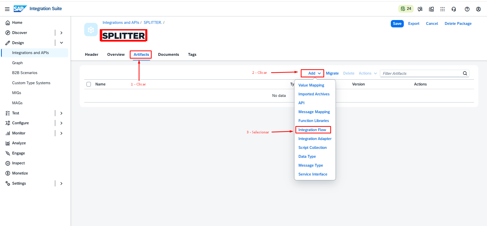
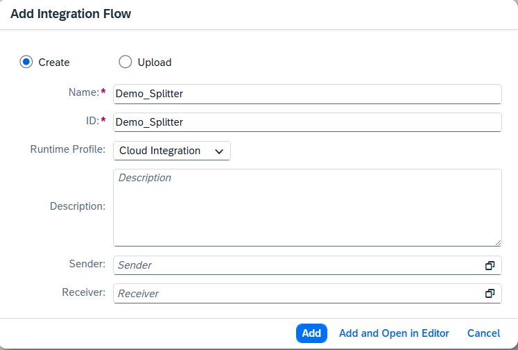
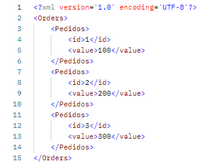

# 🔀 SPLITTER – SAP Cloud Integration (CPI)

Este repositório demonstra como receber um JSON via REST, converter para XML e utilizar o **General Splitter** no **SAP Cloud Integration (CPI)** para processar cada item individualmente.

---

## 📥 Exemplo de Payload JSON

O JSON utilizado no teste pode ser encontrado em:

📄 [`json/ordens.json`](json/ordens.json)

```json
{
  "Orders": {
    "Pedidos": [
      { "id": 1, "value": 100 },
      { "id": 2, "value": 200 },
      { "id": 3, "value": 300 }
    ]
  }
}
```

## 🔄 Fluxo do iFlow









## 📦 Exemplo prático – iFlow para baixar

📦 [Download do iFlow – SPLITTER.zip](Package/SPLITTER.zip)

> O arquivo pode ser importado diretamente no SAP Integration Suite (CPI).
